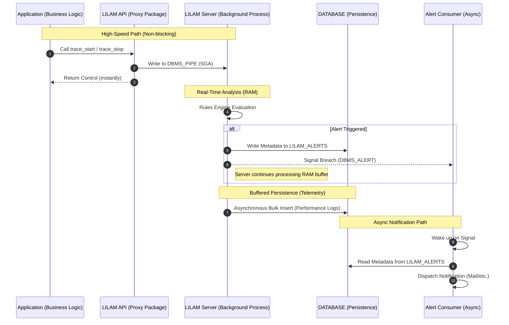

# Asynchronous Alerting Architecture

## Overview

To maintain high throughput (> 2,500 EPS), LILAM strictly decouples event analysis from notification dispatch. This prevents external latencies (e.g., SMTP handshakes) from impacting the core processing loop.

* **Responsiveness (RAM-First):** LILAM prioritizes immediate alerting over persistence. Alerts are triggered directly from the RAM-resident Rules Engine via [DBMS_ALERT].
* **High-Throughput Buffering:** To maintain > 2,500 EPS, event persistence is decoupled and buffered. Data is flushed to the `MONITOR_TABLES` asynchronously with a controlled delay (up to 1.8s), ensuring disk I/O never bottlenecks the real-time analysis.

To ensure no alert is ever lost, LILAM follows a Write-then-Signal pattern. When a rule violation is detected, the server immediately persists the alert metadata to the `LILAM_ALERTS` table before signaling the asynchronous consumer. This guarantees that the consumer always finds a valid record to process upon wakeup, maintaining high reliability even under heavy load.

### Alert Handshake Workflow


> **Note:** LILAM rules are not limited to error detection. They can also be used to track positive business milestones or validate complex event sequences (e.g., "Event B must follow Event A within X seconds").


## Configuration
Rules define how LILAM validates incoming events. Each rule shares a common set of parameters that specify which event type to monitor, the evaluation criteria to apply, and the corresponding action to take when a rule is triggered (e.g., notifying on a threshold breach or confirming an expected sequence of events).
Rules are organized into Rule Sets, which are stored as JSON objects in the LILAM_RULES table. Within these JSON objects, individual rules are managed as structured arrays for efficient processing.

action + context
### Rule Set Structure
| Property | Type | Description
| :-- | :-- | :--
| header | object | metadata for the rule set
| header.rule_set | string | name of rule set
| header.rule_set_version | number | versioning eg. for testing
| header.description | human-readable purpose of the rule set
| rules | array | collection of rules
| rules.id | string | key of rule
| rules.trigger_type | enum | specific hook or lifecycle stage that activates the rule evaluation¹
| rules.action | string | name of trigger
| rules.context | string | optional additional filter to narrow down a rule to a specific instance of an action²
| rules.condition | object | metadata for conditions
| rules.condition.operator | string | name of filter to validate
| rules.condition.value | string | specifies the filter (can be a number, a range or the combination of values)
| rules.alert | object | metadata of the alert
| rules.alert.handler | string | any kind of a following process which processes the alert
| rules.alert.severity | enum | serverity level as an information for the handler
| rules.alert.throttle | number | the number of seconds within the same alert has to be ignored


¹The trigger_type acts as a filter to determine when a rule should be evaluated. It maps to the core API calls of the LILAM instrumentation, such as starting a transaction (TRACE_START), hitting a specific milestone (MARK_EVENT), or completing a process (PROCESS_STOP).

### Hooks
| hook | event type | effect
| :-- | :-- | :--
| ON_EVENT, ON_START, ON_STOP | Event, Transaction, Process | synonyms for reacting on incoming signals
| ON_UPDATE, PROCESS_START, PROCESS_STOP | Process | dedicated to changes of Processes

### Operators
| operator | value / range | event type | description
| :-- | :-- | :-- | :--
| AVG_DEVIATION_PCT | percent | Event, Transaction, Process | average duration as EWMA (...)
| MAX_DURATION_MS | milliseconds | Event, Transaction | maximum milliseconds of duration; calculated for events from signal to signal
| MAX_OCCURRENCE | count | Event, Transaction | max. allowed number of succeeded signals by action + context (context if used)
| MAX_GAP_SECONDS | seconds | Event, Transaction | max. lapse of time between last and actual incoming Event or Transaction identified by action and context
| PRECEDED_BY | name and context | Event, Transaction, Process | matches action + context (if used) of the predecessor with the rules condition
| PRECEDED_BY_WITHIN_MS | name and context and milliseconds | Event, Transaction, Process | extends the PRECEDED_BY rule with a time factor


²The context field allows you to apply rules more selectively. Use it to differentiate between various instances of the same action. This is particularly useful when different thresholds or SLAs apply to specific locations or segments (e.g., a "Speed Limit" rule that only applies to a specific track section).
For example rule SEQ-003 only monitors travel times for the specific track segment SECTION_400_001, rather than every segment on the line.

```json
    {
      "id": "SEQ-003",
	  "_comment": "Mehr als 25 Sekunden dauert die Fahrt nicht. Irgendetwas hat den Zug aufgehalten.",
      "trigger_type": "TRACE_STOP",
      "action": "TRACK_SECTION",
      "context": "SECTION_400_001"
      "condition": {
        "operator": "MAX_DURATION_MS",
        "value": "25000"
      },
      "alert": { "handler": "MAIL_LOG", "severity": "WARN", "throttle_seconds": 0 }
    }

```


### Table LILAM_RULES


LILAM servers support dynamic rule set updates at runtime. Active configurations are persisted in the `LILAM_SERVER_REGISTRY`, ensuring that servers automatically reload the correct rule sets upon restart:
```sql
exec LILAM.SERVER_UPDATE_RULES(p_processId => 1202, p_ruleSetName => 'METRO Rules', p_ruleSetVersion 2);
```
