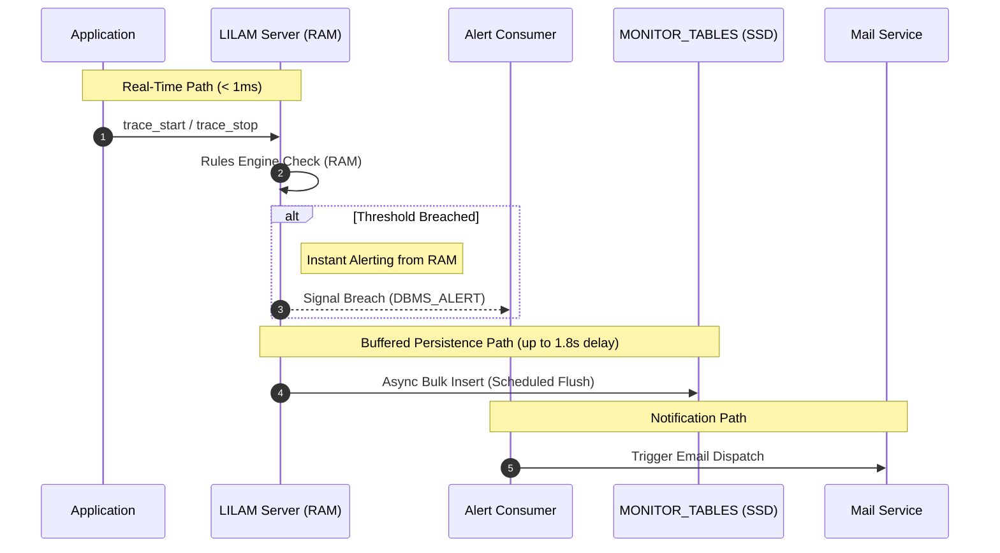

## Asynchronous Alerting Architecture

To maintain high throughput (> 2,500 EPS), LILAM strictly decouples event analysis from notification dispatch. This prevents external latencies (e.g., SMTP handshakes) from impacting the core processing loop.

* **Responsiveness (RAM-First):** LILAM prioritizes immediate alerting over persistence. Alerts are triggered directly from the RAM-resident Rules Engine via [DBMS_ALERT].
* **High-Throughput Buffering:** To maintain > 2,500 EPS, event persistence is decoupled and buffered. Data is flushed to the `MONITOR_TABLES` asynchronously with a controlled delay (up to 1.8s), ensuring disk I/O never bottlenecks the real-time analysis.

### Alert Handshake Workflow

