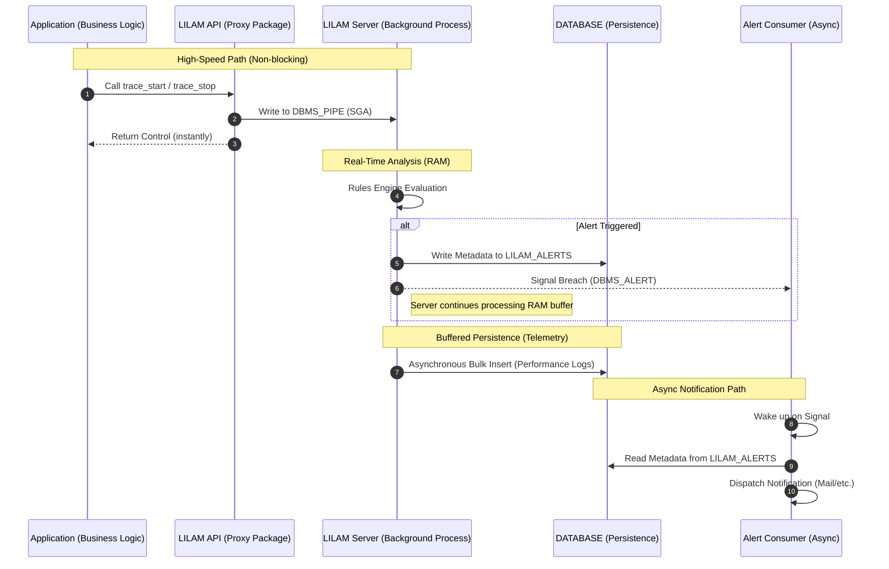

# Asynchronous Alerting Architecture

## Overview

To maintain high throughput (> 2,500 EPS), LILAM strictly decouples event analysis from notification dispatch. This prevents external latencies (e.g., SMTP handshakes) from impacting the core processing loop.

* **Responsiveness (RAM-First):** LILAM prioritizes immediate alerting over persistence. Alerts are triggered directly from the RAM-resident Rules Engine via [DBMS_ALERT].
* **High-Throughput Buffering:** To maintain > 2,500 EPS, event persistence is decoupled and buffered. Data is flushed to the `MONITOR_TABLES` asynchronously with a controlled delay (up to 1.8s), ensuring disk I/O never bottlenecks the real-time analysis.

To ensure no alert is ever lost, LILAM follows a Write-then-Signal pattern. When a rule violation is detected, the server immediately persists the alert metadata to the `LILAM_ALERTS` table before signaling the asynchronous consumer. This guarantees that the consumer always finds a valid record to process upon wakeup, maintaining high reliability even under heavy load.

### Alert Handshake Workflow


> **Note:** LILAM rules are not limited to error detection. They can also be used to track positive business milestones or validate complex event sequences (e.g., "Event B must follow Event A within X seconds").


## Configuration
Rules define how LILAM validates incoming events. Each rule shares a common set of parameters that specify which event type to monitor, the evaluation criteria to apply, and the corresponding action to take when a rule is triggered (e.g., notifying on a threshold breach or confirming an expected sequence of events).
Rules are organized into Rule Sets, which are stored as JSON objects in the LILAM_RULES table. Within these JSON objects, individual rules are managed as structured arrays for efficient processing.

action + context
### Rule Set Structure
| header | 

{
  "header": {
    "rule_set": "TEST_SUITE_METRO",
    "rule_set_version": 1,
    "description": "Validation for Gaps, Deviations and Info-Logs"
  },
  "rules": [


### Table LILAM_RULES


LILAM servers support dynamic rule set updates at runtime. Active configurations are persisted in the `LILAM_SERVER_REGISTRY`, ensuring that servers automatically reload the correct rule sets upon restart:
```sql
exec LILAM.SERVER_UPDATE_RULES(p_processId => 1202, p_ruleSetName => 'METRO Rules', p_ruleSetVersion 2);
```
